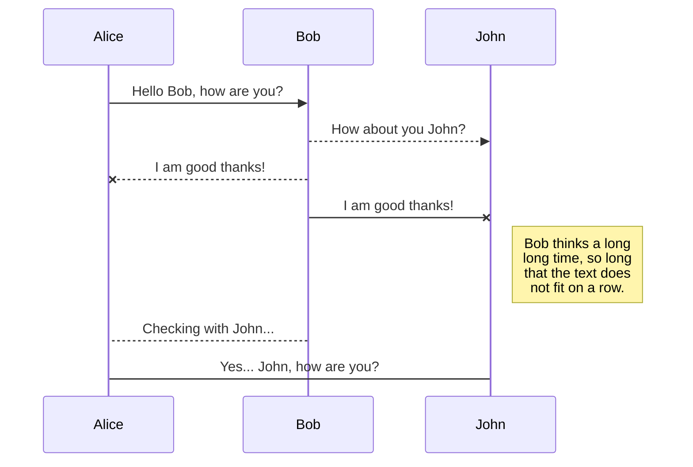
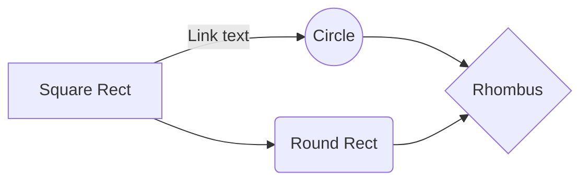

# Array Sorting Exercise

## User Story

Feature: Sorting of an array of grades
  In order to prepare a list of grades for his class,
  from the higher to the smallest,
  a Teacher wants the corresponding grades sorted accordingly.

  Scenario: The Teacher provides the grades for the students.

    Given the list of grades [10, 9, 8, 10, 7, 9, 10] 
     When the Teacher capture grades one by one
      And the program accumulates every grade in an array
      And afther the program executes a sorting on the array elements
     Then the program should return the grades in descending order like [10, 10, 10, 9, 9, 8, 7]

## Analysis

**Objects and Classes**

**Actor:** Teacher
**Components:**
  ArraySortingProgram
  ArrayOfNumbers
  ArraySorter
  InputReader

**Collaborations and Relationships**

ArraySortingProgram [executes] --> ArraySorter
ArraySorter [sort data of] --> ArrayOfNumbers
InputReader [read data from] --> Console
InputReader [populates] --> ArrayOfNumbers

## Design

** Class Model **

** Sequence Diagram **

## UML diagrams

You can render UML diagrams using [Mermaid](https://mermaidjs.github.io/). For example, this will produce a sequence diagram:

And this will produce a flow chart:

